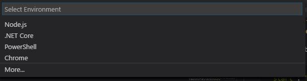
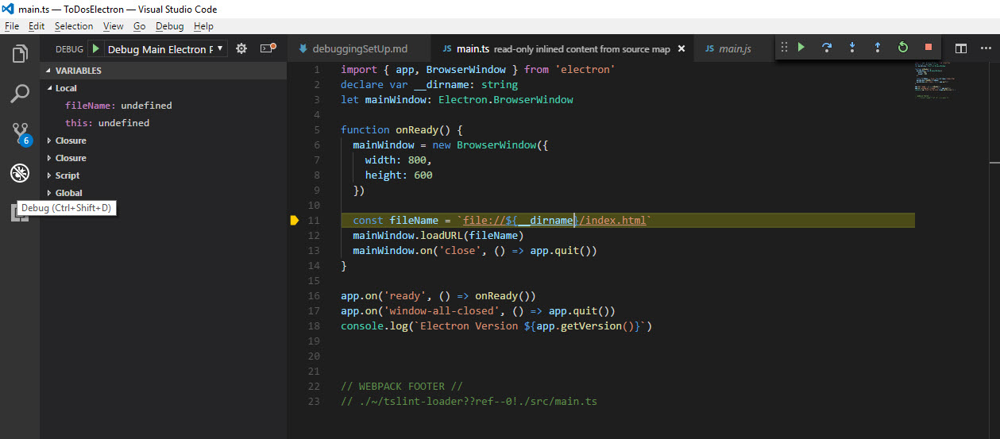
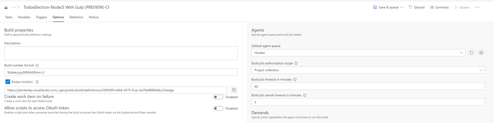

# Setting up VS Code Debugging for TypeScript Electron application

The [last post](https://jdunkerley.co.uk/2017/06/03/how-to-set-up-webpack-based-typescript-electron-react-build-process-with-vsts-ci/) covered the basic set up of TypeScript Electron application being built by WebPack. This post follows on with a couple of extra features mainly around debugging.

Again the complete project can be download from [github](https://github.com/jdunkerley/ToDosElectron/tree/blogPost2).

## Multiple Renderer Entry Points

The current set up builds `src\gui.tsx` into the main entry point of the renderer process (`dist\index.html`). In order to allow for separate windows, the idea is to have multiple top level React components which will become separate HTML pages. 

The first step for this is to add a function to `webpack.config.js` which finds all the `tsx` files in the `src` directory. Unlike the similar setup for the test config, it shouldn't scan sub-folders allowing for other non-top level components to be kept in folders. Also as with the test set up, when running in watch mode WebPack won't pick up new files added to the folder and needs to be restarted in that case. Add the following code to the config file:

``` javascript
const fs = require('fs')

const guiEntries =
  fs.readdirSync('src')
    .filter(f => f.match(/.*\.tsx$/))
    .map(f => path.join('src', f))
    .reduce((memo, file) => {
      memo[path.basename(file, path.extname(file))] = path.resolve(file)
      return memo
    }, {})
```

This code will create a dictionary of entry points of all `tsx` files. This can be used in the `electron-renderer` target setting replacing `entry: { gui: './src/gui.tsx' },` with `entry: guiEntries,`. Rebuilding the project now produces the same output as before. Next, add a new file `src/secondui.tsx`:

``` javascript
import React from 'react'
import ReactDOM from 'react-dom'

ReactDOM.render(
  <div>Electron version: {process.versions.electron}</div>,
  document.getElementsByTagName('body')[0])

```

Rebuild the project and a new `dist/secondui.js` file will be created. There is however only one html file generated by `HtmlWebpackPlugin`. In order to make this plugin build multiple html files, there needs to be a plugiin for each entry. Using the `map` function on the `guiEntries` replace the plugins with:

``` javascript
plugins: Object.keys(guiEntries).map(k =&gt; new HtmlWebpackPlugin({ filename: `${k}.html`, chunks: [k]}))
```

Re-running the build again and in the `dist` file there should be:

- `gui.html`
- `gui.js`
- `secondui.html`
- `secondui.js`
- `main.js`

If the build has already been run there will also be `index.html` file. There is a plugin for WebPack which will clean out folders before building. Run

``` bash
yarn add -D clean-webpack-plugin
```

and then add:

``` javascript
const CleanWebpackPlugin = require('clean-webpack-plugin')
```

to the top of the `webpack.config.js` and alter the `plugins` to be:

``` javascript
      plugins: [
        new CleanWebpackPlugin(['dist'], { exclude: ['main.js'] }),
        ...Object.keys(guiEntries).map(k =&gt; new HtmlWebpackPlugin({ filename: `${k}.html`, chunks: [k] }))
      ]
```

(the new ... spread operator is fantastic!). 

The first setting on [`CleanWebpackPlugin`](https://github.com/johnagan/clean-webpack-plugin) tells it which folders to clean. The second is a set of options, in this case telling it to ignore the output of the parallel `electron-main` build process.

Another improvement to this part of the process is to pick up different template files. This needs to be done on a per entry point basis. Ideally, if a specific template file exists then we want to use that otherwise fallback to using a default. The HTML plugin takes a `template` option allowing for a file to be passed in. Create a new file called `src/default.ejs` with the following content:

``` html
<!DOCTYPE html>
<html>
  <head>
    <meta charset="UTF-8">
    <title><%= htmlWebpackPlugin.options.chunks[0] %></title>
  </head>
  <body>
    <div id="root"></div>
  </body>
</html>
```

This template adds a `root` element the React renderer can use and it also picks the title up from the chunk being built. To tell the plug-in to use it, add a template entry to the options object. The code below looks to see if an `ejs` file with the same name as the `tsx` file exists, otherwise, it uses the default file above:

``` javascript
template: fs.existsSync(`src/${k}.ejs`) ? `src/${k}.ejs` : 'src/default.ejs'
```

Rebuilding now the output HTML files should be based on the template above.

## Visual Studio Code Debugging

In order to help with debugging, the build process needs to output generated sourcemap files. The `tsconfig.json` already has the option set on it to produce them but they are not being written out. To make webpack write them, add a `SourceMapDevToolPlugin` to both build configs. The final `module.exports` looks like:

``` javascript
module.exports = [
  Object.assign(
    {
      target: 'electron-main',
      entry: { main: './src/main.ts' },
      plugins: [ new webpack.SourceMapDevToolPlugin({ filename: '[name].js.map' }) ]
    },
    commonConfig),
  Object.assign(
    {
      target: 'electron-renderer',
      entry: guiEntries,
      plugins: [
        new CleanWebpackPlugin(['dist'], { exclude: ['main.js'] }),
        new webpack.SourceMapDevToolPlugin({ filename: '[name].js.map' }),
        ...Object.keys(guiEntries).map(k =&gt; new HtmlWebpackPlugin({ filename: `${k}.html`, chunks: [k] }))
      ]
    },
    commonConfig)
]
```

There are a few useful extensions to add to working within Visual Studio Code easier:

- `yarn`: integrates running yarn commands within Visual Studio Code.
- `TSLint`: gives real time linting of TypeScript files within the editor.
- `JavaScript Standard Style`: adds real-time linting of JavaScript files following StandardJS rules.
- `Debugger for Chrome`: gives a chrome debugging mode, needed for debugging the renderer.

Electron has a couple of command line options which can be used to help to debug:

- `--enable-logging`: Prints Chromium's log messages to the console.
- `--debug=[port]`: enables NodeJS debugging of the main process.
- `--debug-brk=[port]`: same as `debug` but breaks on the first line of the code.
- `--remote-debugging-port=[port]`: enables a debugging port on the Chromium renderer.

Cchange the `start` command within the `packages.json` file to turn on these options:

``` json
"start": "electron dist/main.js --enable-logging --remote-debugging-port=9222 --debug-brk=5858"
```

The easiest way to configure Visual Studio Code's debugger is to press `F5` within the editor and drop down box should appear allowing configuration of the `launch.json` file. Choose `Node.js` to get a starting point.



Replace the `configuration` section with:

``` json
  "configurations": [
    {
      "name": "Debug Main Electron Process",
      "type": "node",
      "request": "launch",
      "runtimeExecutable": "${workspaceRoot}/node_modules/.bin/electron",
      "windows": {
        "runtimeExecutable": "${workspaceRoot}/node_modules/.bin/electron.cmd"
      },
      "runtimeArgs": [
          "--enable-logging",
          "--remote-debugging-port=9222"
      ],
      "cwd": "${workspaceRoot}",
      "program": "${workspaceRoot}/dist/main.js",
      "timeout": 20000,
      "sourceMaps": true,
      "preLaunchTask": "build"
    },
    {
      "name": "Debug Renderer Process",
      "type": "chrome",
      "request": "launch",
      "runtimeExecutable": "${workspaceRoot}/node_modules/.bin/electron",
      "windows": {
        "runtimeExecutable": "${workspaceRoot}/node_modules/.bin/electron.cmd"
      },
      "runtimeArgs": [
          "${workspaceRoot}/dist/main.js",
          "--enable-logging",
          "--remote-debugging-port=9222"
      ],
      "timeout": 20000,
      "sourceMaps": true,
      "preLaunchTask": "build",
      "webRoot": "${workspaceRoot}"
    },
    {
      "name": "Attach to Main (Port 5858)",
      "type": "node",
      "request": "attach",
      "port": 5858,
      "sourceMaps": true
    },
    {
      "name": "Attach to Renderer (Port 9222)",
      "type": "chrome",
      "request": "attach",
      "port": 9222,
      "sourceMaps": false
    }
  ]
```

This will set up 4 different modes.

- `Debug Main Electron Process`: Rebuilds the code and then runs electron and connects the debugger to the main process. *I found I needed a longer timeout on my machine hence the 20s timeout.*
- `Debug Renderer Process`: Rebuilds the code and connects a chrome debugger to the renderer process. **Requires the Chrome debugger extension.**
- `Attach to Main`: Connects debugger to a running electron instance's main process on port 5858.
- `Attach to Renderer`: Connects debugger to a running electron instance's renderer process on port 9222. **Requires the Chrome debugger extension.**

One issue, I have found is that breakpoints within TypeScript don't work yet and have to place them within the generated JavaScript. Opening `dist/main.js` and adding a breakpoint on the line where the filename is set. Press `F5` and it should open within the debugger:



The code displayed is in TypeScript and you can trace through the program with the debugging functions.

## Visual Studio Team Services Build Badge

(Repeating the great instructions from [Thiago Almeida's blog post](http://www.talmeida.net/blog/2015/12/17/creating-a-badge-on-github-to-show-the-latest-visual-studio-team-service-build-status))

One last little want is to show the status of the Visual Studio build process within GitHub's ReadMe view. Go into Visual Studio Team Services and edit the build definition. Within the Options tab, there is a tick box to enable badges. Select it and save the build. There will then be a URL which you can add to show the state of the build.

 

## What Next

After a little bit more fiddling, the debug environment is now all set up. While I would love to find a solution to breakpoints within the source TypeScript files this is a pretty good set up to work with.

I haven't looked at packaging or release process but this is something for when there is actual content to release!